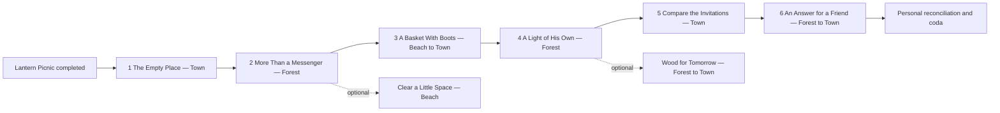

# LooperLands friendship story design

**Working title: A Place for Rowan. Status: awaiting design approval. No implementation is authorised by this document.**

A small continuation of the Lantern Picnic: six main quests, two optional side quests, three existing regions and two personal preferences. The main path now includes linked dialogue puzzles, an NPC-given inventory item used to help another character, and a puzzle that compares different characters' accounts. Estimated first-play length is 40–55 minutes, to be checked in playtesting. The proposed addition is one Rowan placement using an existing sprite. Everything else uses existing actors, resources, regions, music and registered content APIs, with one temporary shared NPC meeting and no scenery changes.

## Synopsis and cast

At the picnic, the neighbours saved a place for Rowan, who used to deliver invitations around the island. Bstrat assumed he knew he was invited. Rowan remembers being asked to carry everyone else's invitations, but never being asked to stay. Neither meant to hurt the other; both have mistaken silence for an answer.

The player finds Rowan taking a break at the southern edge of Forest. He is repairing his old lantern because he enjoys making things, rather than because anyone needs another delivery. A visit to Jimi on Beach reveals the detail Bstrat has forgotten: Rowan used to stay after his errands, drawing silly pictures in the sand. He misses having nothing useful to do with his friends.

A funny drawing described by Jimi identifies a parcel Adam has been saving: the wood was intended for Rowan all along. The player connects those clues, obtains the wood and takes it to Rowan. Then they persuade Bstrat to mind Adam's supplies briefly and arrange for Adam and Town Watch to compare what “the invitations are covered” actually meant. They help Bstrat send an explicit invitation and carry Rowan's warm answer back. Their friendship reconnects through these personal exchanges. The comparison briefly takes NPCs away from their routines, then all return. Reconciliation changes personal dialogue; no permanent gathering or scenery change follows.

The new relationship history below is **proposed story content**, not existing world canon. Rowan's name and role as an absent invitation carrier are already in the shipped picnic.

| Character | Established anchor | Motivation and change |
| --- | --- | --- |
| Rowan | Mentioned in the picnic's final two lines; not placed on current main | Wants to be wanted as a friend, not only as a useful messenger. Learns to say what hurt him and accept an invitation with clear expectations. Proposed `forestnpc` sprite, labelled Rowan locally. |
| Bstrat515 | `villagegirl`, `town-neighbour`; market visits and guesthouse routine | Thought including Rowan in preparations meant including him socially. Learns to ask rather than assume, and to apologise without explaining away his feelings. |
| Ordinary Adam | `villager`, `town-gardener`; supplies, plants, guesthouse | Shows affection by preparing things. Learns that a place at the blanket matters more than another completed task. Retains the player's basket decision. |
| Town Watch | One specific `guard`, `town-watch`; eastern gate, market, town hall | Recognises how a useful role can swallow a person's identity. Clarifies what he actually said about the invitations without leaving his normal rounds. |
| Jimi | Existing `beachnpc`, established by `JIMI_QUEST`, on southeastern Beach | Remembers Rowan as company rather than a courier. Offers a concrete memory, not an omniscient diagnosis. His Dimmie/Big Brimmie storyline and ore quest remain available. |
| Player | Existing picnic helper | Listens, carries spoken messages with permission, helps with one small repair, and chooses how to approach the reconciliation. Does not decide that Rowan must forgive anyone. |

## Adventure game direction

Use the small, connected puzzle structure and comic character logic of a classic point-and-click adventure, with Monkey Island as the reference for feel. Keep LooperLands' own cast, setting and original dialogue. Adam takes his baskets far too seriously; Bstrat cannot resist reorganising things; Watch can make even a friendly invitation sound official; Rowan's dry humour emerges as he relaxes. Let the ending land sincerely without turning every line into a joke.

The player explores a few familiar places, notices an odd detail, asks about it elsewhere, uses that knowledge to get an object, gives the object to someone who needs it, and arranges a short NPC encounter that exposes a misunderstanding before everyone returns to their usual routine. Small failures should be entertaining and informative. The solution follows understandable character logic; no obscure wordplay, pixel hunting or permanently losing a required object.

Present practical actions in contextual NPC dialogue: **Ask about the marked parcel**, **Describe Jimi's drawing**, **Give Rowan three wood**, **Ask Bstrat to mind the supplies**, **Arrange a short meeting**. This is a puzzle-content design using current click-to-talk and inventory systems. A new verb bar, drag-and-drop inventory, clickable prop inspection and item combining are separate optional interface capabilities, not assumed here. The marked parcel can be described by Adam without adding a world interaction target.

## Shared world rule

**Progress, clues, decisions and inventory remain personal. NPCs may temporarily leave their shared routines for a story interaction, but must always return to the routine appropriate to the current world clock.** A bounded, shared comparison meeting is allowed. It must never leave an actor relocated, locked or assigned to a quest-only route after completion, interruption or failure.

The meeting changes only temporary NPC movement and nearby conversation. It does not spawn or remove scenery, empty a shared container, change collisions, open a passage, change music, or grant a bystander progress. No private map decorations or duplicate NPC actors are used. Rowan's proposed placement is a static content addition available to everybody from deployment.

Ordinary shared schedules and progress-neutral banter continue outside the meeting. Existing conversation holds remain supported. The original Lantern Picnic is unchanged; the new meeting waits if it needs actors the picnic already reserved. The final reconciliation is told through personal messages and greetings, not a permanent rearrangement of the world.

## Continuity and choices

Keep `LANTERN_BASKET`, `LANTERN_PATH`, `LANTERN_INVITATION`, and all five existing flags exactly as shipped:

- `lantern:return-basket`
- `lantern:share-basket`
- `lantern:found-basket`
- `lantern:quiet-picnic`
- `lantern:music-picnic`

Completion of `LANTERN_INVITATION` is the sole prologue gate. Read either `COMPLETED` or `FINISHED`, and either saved `id` or `questKey`, through the existing quest-state helper. Picnic attendance memory is not a prerequisite. A returning player can begin immediately, even if they never saw the picnic animation. If an existing picnic or routine temporarily changes an actor's availability, the player can resume the conversation when that actor is available. The comparison meeting waits for existing reservations and restores every borrowed actor afterwards.

Two new, mutually exclusive pairs use ordinary saved choices:

| Choice | Options | Visible consequence |
| --- | --- | --- |
| How to listen, Q2 | `lantern-friendship:listen-first` / `lantern-friendship:ask-directly` | Rowan either volunteers the missing-invitation memory after being given space, or answers a careful direct question. His Q6 response and later personal greeting recall the approach. Both reveal the same essential facts. |
| How Bstrat opens her invitation, Q5 | `lantern-friendship:apology-first` / `lantern-friendship:invitation-first` | The actual words relayed in Q6 differ. Rowan responds to those words. The player's final private coda is “You did not have to earn your place” or “You were asked to stay”. No scenery or public NPC state differs. Both invitations include an apology and neither asks for work. |

These two personal preferences are not scored as right or wrong. The separate dialogue puzzles below do have correct solutions, based on facts characters reveal. Lock each preference pair after selection; repeat dialogue recalls it rather than recording the opposite option. If inconsistent data already contains both, resolve deterministically to the first authored option for display and do not delete either saved flag. Missing old picnic choices use neutral wording and no added music; do not invent a past decision.

Q6 also records the narrative agreement `lantern-friendship:rowan-accepted` when Rowan actually accepts in dialogue. Bstrat's final report requires this fact. It is not an additional branching decision or an alternative objective counter: it prevents a player merely clicking Rowan from claiming he agreed to come.

## Chapter and quest flow

All main quests use `requiredQuest` pointing to the preceding row, plus matching dialogue conditions. `dialogueOnly: true` keeps offers intentional and prevents the generic quest handout from bypassing the authored exchange. Never gate Q4–Q6 on either side quest, a clock phase, a scene-viewed file, or another player's choice. Clicking the right NPC satisfies contact objectives; it does not substitute for the correct dialogue answer or an agreement.

`TALK` below means `NPC_TALKED` with the named actor's stable `npcKey`; `VISIT` means `AREA_ENTERED` using the exact map scene name. Objectives are ordered. Each listed conversation has actual NPC replies, not just a checklist acknowledgement.

| Quest and giver | Prerequisite | Ordered objectives | Locations and direction | Reward and consequence |
| --- | --- | --- | --- | --- |
| **Q1 The Empty Place** — Bstrat; `LANTERN_FRIENDSHIP_EMPTY_PLACE` | `LANTERN_INVITATION` | TALK Adam → TALK Town Watch → TALK Bstrat. End with “I'll ask Rowan what happened.” | Town market, eastern gate/town hall, then Bstrat's market or guesthouse stops. | Q2; the player learns Rowan is taking a break, not missing or in danger. Bstrat asks for a conversation, not a rescue. |
| **Q2 More Than a Messenger** — Bstrat; `LANTERN_FRIENDSHIP_MESSENGER` | Q1 | VISIT Forest → TALK Rowan. Choose a listening approach and acknowledge his answer. | “Leave Town by the northern gate. Rowan stays just beyond the gate, on the southern Forest path.” | Q3; first choice saved. Rowan gives permission to ask Jimi about their old visits. His private greeting becomes less guarded. |
| **Q3 A Basket With Boots** — Rowan; `LANTERN_FRIENDSHIP_LIGHT` | Q2 | VISIT Beach → TALK Jimi → VISIT Town → TALK Adam. Learn Jimi's description of Rowan's comic drawing, inspect Adam's marked parcel through dialogue, then identify its intended recipient. Finish only on the correct answer. | “Walk south through Town to Beach, then follow the shore east and south to Jimi. Adam is at the market or the guesthouse east of it.” | Q4 and **3 real WOOD**, granted once as the quest reward. Adam releases the wood he had set aside for Rowan. The player has solved who it belongs to, not bought an invitation. |
| **Q4 A Light of His Own** — Adam; `LANTERN_FRIENDSHIP_SHORE` | Q3 | VISIT Forest → DELIVER 3 `WOOD` to Rowan. Select “Give Rowan three wood” to confirm the final hand-in. | Rowan on the southern Forest path; ordinary Forest wood can replace gifted wood if it was spent. | Q5; debit three real wood. Rowan accepts the repair materials and asks the player to clear up the invitation misunderstanding. No inventory lantern is created. |
| **Q5 Compare the Invitations** — Bstrat; `LANTERN_FRIENDSHIP_NAME` | Q4 | TALK Adam → TALK Bstrat → TALK Town Watch → TALK Bstrat. Learn Adam's account, arrange for Bstrat to mind his supplies without reorganising them, request a short meeting, then explain the misunderstanding and choose the invitation's opening. | Usual Town locations, then a temporary comparison at the old picnic spot south of the market. All actors return to their routines afterwards. | Correct personal reasoning unlocks Q6; second preference saved. Seeing the shared meeting does not automatically complete objectives or grant clue flags. |
| **Q6 An Answer for a Friend** — Bstrat; `LANTERN_FRIENDSHIP_STAY` | Q5 | VISIT Forest → TALK Rowan → VISIT Town → TALK Bstrat. Rowan accepts in dialogue; report his answer to Bstrat. | Same northern Forest approach, then Bstrat on her normal Town routine. | Campaign completion and a repeatable personal coda. Rowan sends a warm answer for Bstrat; remembered friendship changes only the player's dialogue. |
| **S1 Clear a Little Space** — Jimi; `LANTERN_FRIENDSHIP_SHORE_SPACE` | Q2; optional offer during the Q3 visit | KILL 2 `CRAB` within Beach → TALK Jimi. Only kills after acceptance count. | Existing Beach crab populations. “Two crabs along Beach are enough. Stay out of the northern regions and leave the ordinary roads alone.” | Jimi thanks the player for a little breathing room. A personal greeting recalls it. No exclusive ending, required material reward, or story gate. |
| **S2 Wood for Tomorrow** — Adam; `LANTERN_FRIENDSHIP_SPARE_WOOD` | Q4; optional | VISIT Forest → LOOT 2 `WOOD` → DELIVER 2 `WOOD` to Adam. | Existing Forest pickups, then the market/guesthouse. Wood from elsewhere after the visit also counts. | Replenish Adam's supplies as a voluntary return favour. His later greeting recalls it; never required to keep his gift or finish the friendship story. |

For all six main quests, use `needToReturn: true` with the appropriate reporting NPC and an explicit final dialogue `complete_quest` action. The existing `objectives.ready` guard remains authoritative, together with dialogue conditions for learned clues and agreements. This prevents first clicks from bypassing replies. Q4 uses the existing delivery objective with `needToReturn: true`: the contact records readiness, but only the explicit hand-in reply calls normal completion and debits wood. S2 can use automatic final delivery; S1 uses normal return/report handling. Quest-log copy says “Find out who Adam's marked parcel is for,” “Compare the two accounts,” or “Report back” rather than disclosing the correct answer.

Q3's sole material reward is `{item: WOOD, amount: 3}` through normal quest completion, not a repeatable `give_item` dialogue action. Q4 consumes those three units. This gives a concrete item chain without adding an inventory kind. Do not promise bespoke XP, medals or currency; dialogue completion and event completion do not currently have identical notification/XP paths. The legacy backend's resource/status writes remain non-transactional. If gifted wood is spent or lost, ordinary collected wood is a recovery route, never a repeatable gift exploit.

`AREA_ENTERED` requires an actual entry. In this flow Q2/Q4/Q6 and S2 are accepted in Town, and Q3 on the Forest path before the Beach visit. If someone somehow accepts while already inside its target region, the objective text must explain leaving and re-entering, rather than pretending the engine records arbitrary visited landmarks. Later objectives never count earlier clicks or lifetime kills.

## The linked dialogue puzzles

The player must connect things people have actually said. Three meaningful answers per puzzle are enough. Wrong answers cost no items, close no future branch and reset no earlier progress. They produce a specific correction and let the player ask again. No random combinations, hidden approval meter, timed replies or requirement to exhaust every line.

**Puzzle one — the parcel marked with a basket, Q3.** Rowan's split lantern frame needs three pieces of wood. At Beach, Jimi remembers Rowan's sketches: “His portrait of Adam was a basket wearing boots. Remarkably accurate.” In Town, Adam says he promised the artist three pieces of wood for a lantern, but the wrapping has only that same drawing on it and he cannot remember the name. Ask Adam about the parcel, then connect it to Jimi's memory:

- “That is obviously addressed to a basket.” Adam: “My baskets already have all the wood they need.”
- “It must be yours. It looks just like you.” Adam: “An outrageous likeness is not a postal address.”
- **“Rowan draws you as a basket wearing boots. You saved that wood for his lantern.”** Adam: “Rowan! Of course. I was waiting for the fellow who usually delivers things to collect his own parcel.” Complete Q3 and award three real wood.

Record `lantern-friendship:parcel-described` when Adam describes the marking. The successful answer requires that clue, Rowan's project and Jimi's drawing memory; opening either NPC once is insufficient. Before the evidence is available, Adam suggests asking somebody who spent time with Rowan off duty. The marking is original proposed story content, not a claim about existing map art. No unique inventory parcel is needed: Adam opens it and gives the existing WOOD resource. The player explicitly gives those units to Rowan in Q4. Rowan: “A parcel for me. I was beginning to think those only went in the other direction.”

**Puzzle two — get Adam away from his baskets briefly, Q5.** Adam says, “Watch told me the invitations were covered. Naturally, I stopped worrying. A very productive decision.” He will compare accounts, but not leave the market supplies unattended. Bstrat offers to help: “I could finally put his baskets in a sensible order.” Adam's earlier warning supplies the clue: “Last time I couldn't find the small basket for three days. It was inside the large one. Organised.”

Ask Bstrat **to watch the supplies and leave every basket where it is**. She agrees: “Even the small one beside the large one? A challenging assignment.” Record `lantern-friendship:stall-covered`. This is a personal agreement; no actor moves yet.

Now ask Watch **“Bstrat can mind the supplies. Meet Adam briefly and compare who invited Rowan.”** Requests to abandon the patrol or declare Rowan wrong get a useful refusal. The correct request requires Adam's account and Bstrat's agreement. Watch replies: “Meet us at the old picnic spot south of the market. We will come when the others are free.” Record `lantern-friendship:compare-requested`. When the eligible player approaches, a shared scene reserves Adam, Watch and Bstrat. Bstrat takes Adam's nearby market stop while the others meet at the old picnic spot. They converse, then all resume their normal routines. The gathering is temporary, not a world-state unlock.

**Puzzle three — explain the mismatch, Q5.** Return to Bstrat with both accounts:

- “Rowan lost his invitation.” Bstrat: “Did either of them say they gave him one?”
- “Watch deliberately kept Rowan away.” Bstrat: “What did he say that made you think it was deliberate?”
- **“Each thought the other had invited him. Nobody actually asked Rowan to stay.”** Bstrat: “Then this time I will use his name. Possibly twice.” This unlocks the apology-first/invitation-first preference and Q5's final completion reply.

Use existing `record_choice`/`choice_made` for `lantern-friendship:rowan-project`, `lantern-friendship:jimi-memory`, `lantern-friendship:parcel-described`, `lantern-friendship:adam-account`, `lantern-friendship:stall-covered`, and `lantern-friendship:compare-requested`. Record each only in its relevant clue node, with the prior facts required. The correct explanation records `lantern-friendship:invitation-understood` before exposing Bstrat's personal preference options. These are learned facts, not replacements for objective counters or inventory. Gate reward-bearing actions as well as options. Wrong answers grant nothing and remain retryable. Reopening a conversation recalls known clues. No scene-viewed or actor-position fact is needed. The meeting is the intended source of the answer; an actor can also repeat their own account privately if it was missed. That fallback avoids tying personal progress to another player's control of shared actors.

## Representative dialogue

These are the intended exchanges. Split long passages into short nodes and end each choice node with its question. Ordinary speech uses the existing NPC text flow; meaningful player lines are choice labels with an explicit NPC response. Current main does not provide the draft's full in-world player-speech presentation.

**Q1 — Bstrat, after the picnic**

> Bstrat: “We saved Rowan a place. I keep thinking about that empty bit of blanket.”
>
> Player: “Was he expecting an invitation?”
>
> Bstrat: “He used to deliver them. I thought he knew he was included. Listen to me: I thought. I never asked.”
>
> Player: “Is he all right?”
>
> Bstrat: “Town Watch saw him by the Forest path. Before you go, ask Adam what we actually said to him. I'd rather send you with the truth.”

Adam recalls the old basket choice without changing it:

> Adam, share save: “You helped us share one basket. I wish I'd been as clear with Rowan. I said, ‘Could you take these round?’ Nothing about coming back.”
>
> Adam, return save: “You helped Bstrat return my basket so I could pack the bread. With Rowan, I remembered the job and forgot to say there was bread for him too.”
>
> Player: “Did you want him there?”
>
> Adam: “Of course. That was the part I left unsaid.”

Town Watch provides a routine hint in context:

> Watch: “Rowan passed the northern gate. He said he was taking a little time for himself.”
>
> Player: “Can I find him without disturbing him?”
>
> Watch: “He rests on the Forest path just beyond the gate. He stays close to that path, even when he puts his lantern down for the night. Ask whether he'd like company.”
>
> Player: “And if I need you again?”
>
> Watch: “Try the eastern gate or the market road. After the night watch I rest in the town hall beside the gate. You can knock.”

**Q2 — Rowan, meaningful choice one**

> Rowan: “If those are more invitations, someone else will have to carry them.”
>
> Player A: “No errand. Would you like some company?”
>
> Rowan: “You can stay a moment. I used to bring the invitations back and wait for somebody to ask me to stay. It seems a silly thing to have waited for.”
>
> Player: “It isn't silly to want to be asked.”
>
> Rowan: “Thank you for not hurrying past that.”

Or:

> Player B: “Bstrat missed you. What made you stay away?”
>
> Rowan: “Did she miss me, or the person who knew all the roads?”
>
> Player: “She doesn't know how it felt to you. I'm asking so I don't guess.”
>
> Rowan: “Then here's the plain answer: I wanted an invitation with my name on it.”

Both branches converge:

> Rowan: “Jimi remembers when my walks weren't all deliveries. If you see him on Beach, you can ask about those afternoons.”
>
> Player: “May I tell Bstrat what you've told me?”
>
> Rowan: “Yes. Tell her I missed being her friend. You don't have to repeat every word.”

**Q2 to Q4 — the object puzzle**

> Rowan: “The lantern is mine. For once, the broken thing isn't somebody else's errand.”
>
> Player: “What does it need?”
>
> Rowan: “Three pieces of wood. There are usually offcuts at the Town market. Try asking rather than helping yourself. Adam counts things.”

At Beach:

> Jimi: “Rowan drew Adam as a basket wearing boots.”
>
> Player: “Did Adam like it?”
>
> Jimi: “He complained about the boots. Apparently he owns a better pair.”

Ask Adam about the parcel, then identify the drawing as in puzzle one. His gift is a quest reward with normal inventory ownership. A wrong identification produces a joke and another opportunity to think.

At Rowan, with wood in inventory:

> Player: “Give Rowan three wood.”
>
> Rowan: “My parcel made it through the delivery system. I should resign more often.”
>
> Player: “You can make something just because you want to.”
>
> Rowan: “I think I'll start with this. Then perhaps an unflattering portrait.”

The lantern repair is acknowledged in personal dialogue only; no item sprite or scenery changes. If the player lacks enough wood, Rowan says how many are missing and suggests the existing Forest pickups. Do not debit anything on an unsuccessful hand-in.

Optional combat remains a separate offer from Jimi:

> Jimi: “Two of the crabs on Beach have decided the path belongs to them. I admire their confidence more than their manners.”
>
> Player: “I'll help clear a little space.” / “I'll leave them to their negotiations.”

**Q5 — arrange the comparison**

> Bstrat: “I could organise Adam's baskets while he talks to Watch.”
>
> Player: “Just watch them. Leave every basket exactly where it is.”
>
> Bstrat: “Even the small one beside the large one?”
>
> Player: “Especially that one.”
>
> Bstrat: “A challenging assignment. I'll do my best.”

After the proper request to Watch, the actors temporarily gather as outlined below. The player later explains their misunderstanding to Bstrat in personal dialogue. Neither hearing the scene nor borrowing the actors grants another player a solution flag.

**Q5 — choose the invitation, not Rowan's answer**

> Bstrat: “I was going to say we need his lantern. There I go again.”
>
> Player: “What do you actually want?”
>
> Bstrat: “To sit with my friend. To hear what he notices when he walks. How should I begin?”
>
> Player A: “Start with the apology. Let him hear that you understand.”
>
> Bstrat: “Then tell him: ‘Rowan, I'm sorry I only spoke about the deliveries. I want your company. Please come and sit with us. Bring nothing.’”

Or:

> Player B: “Say his name and invite him clearly. Then explain.”
>
> Bstrat: “Then tell him: ‘Rowan, will you come and sit with me? Bring nothing. I'm sorry I left that invitation unsaid.’”

**Q6 — Rowan responds to the actual chosen words**

> Rowan, apology first: “She noticed the difference. That's what I needed to hear.”
>
> Rowan, invitation first: “My name, and no job after it. Yes. Tell her yes.”
>
> Player: “What shall I tell Bstrat?”
>
> Rowan: “Tell her I miss her terrible tea. And that I would like to have some again. That should sound like me.”

The player carries that answer back. Bstrat replies privately: “Tell him it has not improved. Neither has my company. I am glad he wants both.” The reconciliation is expressed in the messages and later personal greetings. Rowan stays on his usual Forest routine. No departure, arrival or gathering is implied to have happened.

**Personal coda — always readable after Q6**

> Player: “Are you glad you said yes?”
>
> Rowan: “Yes. We don't have to solve everything before spending time together.”
>
> Rowan, listen first: “You gave me time before asking for an answer. I remember that.”
>
> Rowan, ask directly: “You asked what was wrong instead of deciding for me. I remember that.”
>
> Rowan, apology first: “I didn't have to earn my place.”
>
> Rowan, invitation first: “This time, I was asked to stay.”

This coda recalls the personal agreement and messages. A repeatable “Remind me what we agreed” branch recaps them from quest/choice state. It never claims a public reunion took place.

## NPC banter and the ending

Keep NPC–NPC banter independent of individual story progress. It can play when ordinary shared routines naturally bring the characters together; the player never summons it or needs to hear it to progress. Existing chatter budgets and conversation holds still apply. No new routes or clock windows are required.

> Adam: “I have counted the baskets twice.”
>
> Bstrat: “Same answer?”
>
> Adam: “Eventually.”

> Watch: “A quiet patrol is a good patrol.”
>
> Adam: “Does that work for markets?”
>
> Watch: “I have never been able to test it here.”

### Temporary comparison scene

This is the only new shared story scene. It is a short detour, followed by restoration, with no scenery or music changes. The earlier staged reunion is replaced by the personal-message ending above.

- **Actors:** Adam and Watch at the existing blanket area; Bstrat at Adam's nearby existing market stop. Use the original routines' collision-valid positions. No Rowan travel is needed.
- **Trigger:** the player's Q5 is open, `adam-account`, `stall-covered` and `compare-requested` are recorded, the player approaches the blanket and has not already attended a successful comparison. Use `eligible(player, data)`; do not combine it with `trigger.questCompleted`.
- **Availability:** reserve all three actors together through the existing Cutscene runner. If any is busy in another scene, wait. Dialogue holds remain supported. All arrive before speech starts; there is no requirement that one actor's arrival precede another's departure.
- **Gathering limit:** 180 seconds, using ordinary pathfinding, public schedule doors and occupied-destination fallback. Never teleport to force success.
- `speech` Bstrat: “All baskets present. None improved.”
- `speech` Adam: “Watch, you said the invitations were covered.”
- `speech` Watch: “Delivered. Rowan delivered them.”
- `speech` Adam: “Including his?”
- `wait` two seconds.
- `speech` Watch: “I thought you had asked him.”
- `speech` Adam: “I thought you had.”
- `speech` Bstrat: “A very efficient system. Nobody had to say anything.”
- `wait` two seconds.
- `speech` Adam: “We should probably change that part.”
- **End:** release all actors, restore their normal route definitions and clear temporary paths/overrides. Re-evaluate the current schedule phase: an actor whose bedtime passed during the scene goes home, rather than remaining at the meeting or resuming an obsolete daytime stop.

Use six-second speech gaps, approximately 50–60 seconds total. There are no scenery `cue` steps, item grants, quest-completion actions or public mentions of the owner's private choices. The external content script uses `Cutscene` plus a small lifecycle wrapper; the existing renderer is untouched.

### Restoration is required on every exit

The wrapper calls normal unsuccessful cleanup for arrival failure, an actor disappearing, a thrown script error, owner disconnect/death/map departure, owner leaving the audience area for ten seconds, or 180 seconds of active playback with no successful finish. Also restore if the world becomes empty; do not rely solely on the base runner's tick, which returns early without players. Use `forget`/disconnect cleanup and the external wrapper to release reservations. On server restart, scene state is discarded and actors load their standard positions and clock-based routines.

Cancellation never resets quests, clues or items. Failed scenes may retry after 30 seconds; successful scenes use a shared 60-second cooldown. Existing per-avatar attendance suppresses unnecessary automatic repeats but is never a quest prerequisite. A completed player's NPC greetings do not keep actors in a different routine.

## Multiplayer and recovery contract

| Element | Scope and behaviour |
| --- | --- |
| Dialogue clues, correct answers and friendship choices | Personal saved state. Different players hear appropriate private replies from the same NPC. Their choices are never quoted by public scene speech. |
| Gift and delivery | Three wood to the solving player's inventory, then three wood debited on explicit hand-in. The described parcel is not a shared chest and never empties for others. |
| NPC routines | Shared. The comparison borrows actors temporarily, then always returns them to normal current-clock routines. No permanent relocation, new quest-dependent schedule or cloned actors. |
| Comparison conversation | Shared and locally audible. Bystanders can watch but receive no clue, quest or item credit. They must still complete their own dialogue prerequisites. |
| Scenery, roads, buildings, lighting and music | Unchanged. No blanket, repaired-lantern sprite, open parcel, private decoration or quest music override is added. |
| Combat and ground pickups | Existing multiplayer rules and respawns. No permanent mob clearing, reserved drops or party-wide quest credit. |
| Ending | Personal reconciliation through messages and later dialogue. No permanent gathering is claimed. |

Two simultaneous eligible players may share one comparison performance. The runner records attendance independently; the external wrapper prunes absent/dead attendees before success. Attendance means participation, not proof that every line was heard. A late arrival can request the actors' accounts privately, then answer Bstrat using their own dialogue state. If a player already solves Q5 before their scene starts, skip that unnecessary performance; an active shared performance finishes normally for its audience and restores actors.

Closing dialogue, leaving, dying or disconnecting preserves successfully saved clues/objectives. Resume from the latest saved stage; an unsaved reply can be selected again. The existing reward guard handles ordinary repeated claims, with the documented non-transactional backend limitation retained. Spent wood can be recollected without repeating the gift puzzle.

No scene script writes quest completion, puzzle-solution flags or inventory. A server restart or lost attendance file may allow another performance but cannot grant another reward. All authoritative progression stays in the existing avatar quest/choice storage.

## Routines, ambience and music

Keep Adam, Bstrat and Watch's existing schedules. Their shared free time is around world hours 16–18, but the story is available all day. Sleeping actors remain interactable. Reveal useful whereabouts in conversation, never by presenting a timetable or numeric coordinates to players.

Rowan gets a modest schedule using existing fields: work/rest stops along the southern Forest approach at the proposed placement and two nearby points; at night he rests at the same outdoor spot. Use `buildings: []`. Do not invent a hut or promise a bed animation. The reused sprite has only an idle-down animation; his movement uses the engine's existing legacy-sprite fallback. Give Jimi a stable behavior key and a stationary or one-tile routine at his existing placement so he participates in keyed objectives and personal reactions without leaving his other storyline's location.

Use `WorldTime.duration` and `mainDaylight` as they exist: a one-hour server-uptime cycle, 40 minutes daylight, five dusk, ten night, five dawn. Schedule hours are a linear 0–24 mapping onto that same cycle; do not assume hour 18 means dusk. Dusk begins at world hour 16, night at 18, dawn at 22. No real-time clock, new regional clock or time jump.

| Region or scene | Ambient presentation | Audio |
| --- | --- | --- |
| Town | Existing night fireflies; ordinary world lighting. Gatherings read equally well in daylight. | Existing `village`. |
| Forest | Existing leaves and pollen, clipped to the authored Forest bounds. No repair decoration is added. | Existing `forest`; leave it unmodified during conversations. |
| Beach | Existing spray and sand. A quiet, unhurried conversation with Jimi; no invented storm or weather state. | Existing `beach`. |
| Personal ending conversations | Ordinary regional presentation, unchanged. | Existing region music; no quest override. The old quiet/music choice remains saved and may be recalled in dialogue. |

No new music, voice acting, synchronized soundtrack seeking, regional tint or weather system is needed. Accessibility does not depend on sound, colour, particle motion or completing dialogue without interruption.

## Verified content and proposed additions

Inspection baseline: GitHub `main` at `c3bec20c99295c6f9876412d54080b81e13b2c06`, the merge of [PR 1499](https://github.com/looperlands/looperlands/pull/1499), checked on 8 October 2026. [Draft PR 1492](https://github.com/looperlands/looperlands/pull/1492), head `b9c51a61e3d4ae59965a269157dbf77992426d16`, is historical reference only. Its virtual satchel, StoryObjectives engine, private passages and broad campaign are not part of this design.

There is no repository `AGENTS.md` in that main tree or the current checkout, and no such file in the checked parent directories. The AGENTS instructions supplied in this chat apply: keep technical jargon in English when writing Dutch; tag agent-written review comments with 🤖. The local dirty checkout is not the source baseline and remains untouched except for these design documents.

Developer coordinates below are implementation references only. They must never appear in dialogue, quest labels or player directions. Runtime static entity placement adds one to the export's decoded X; the following NPC/wood positions account for that.

| Verified entity or place | Evidence and access |
| --- | --- |
| Adam | Existing `villager` runtime spawn `(37,200)`, key `town-gardener`. |
| Bstrat | Existing `villagegirl` runtime spawn `(15,222)`, key `town-neighbour`. |
| Town Watch | Existing selected `guard` runtime spawn `(73,197)`, key `town-watch`. Other guards exist; match this key, not every guard. |
| Jimi | Existing `beachnpc` runtime spawn `(76,293)`, named by `JIMI_QUEST`. Proposed key `friendship-jimi` controls that same actor, not a duplicate. |
| Rowan | Absent from placed NPCs; `forestnpc` kind 52 and its 1×/2×/3× sprite assets already exist. The existing green-clothed sprite has been visually inspected. New runtime spawn proposed at `(43,185)`, with stops `(43,181)` and `(44,190)`. |
| Town, Forest, Beach | Actual scene names/IDs are Town 624, Forest 628, Beach 627. Static collision searches connect the picnic to proposed Rowan in 32 walking steps and to a tile beside Jimi in 110 steps while excluding every door tile. These are data-level reachability checks, not a live multiplayer playtest. |
| Original picnic | Existing centre `(42,216)`, south of market; retained as a familiar landmark. No continuation scene is placed there and Rowan does not travel there for this story. |
| Guesthouse | Public reciprocal doors `(51,205)` ↔ `(154,143)`; existing shared Adam/Bstrat schedule building east of the market. No NFT, collection, trigger or cross-map gate on this pair. |
| Town hall | Public reciprocal doors `(77,206)` ↔ `(126,143)`; existing Watch schedule building beside eastern gate. Same public-door checks. |
| Wood | `WOOD` 50000010, normal collectable, one unit by default, 150-second respawn. Existing Forest pickups include runtime `(59,162)` and `(81,178)` with door-free walking paths. Delivery uses normal inventory balances. |
| Crabs | `CRAB` 7, normal base level 2; several existing Beach roaming areas, including the southeastern shore. Do not assume base level proves difficulty for every avatar/modifier. |
| Music | `village`, `forest`, `beach`, `fluteguitar` exist in audio registration and shipped MP3 assets. |

Do not choose the Windmill: its old room still exists as a scene, but the exterior entrance now leads to `cobsfarm`. Do not use Party beach shortcuts, PvP rooms, Fight Night, Short Destroyers collection gates or any other map portal. The designed route uses the main map's outdoor walking connections and, when needed, the two already validated public schedule buildings.

**Separate additions for approval:**

1. One new Rowan spawn in `main.tmx`, using the existing `forestnpc` sprite/kind, plus the necessary map-export/tileset entity metadata. No terrain, door, gate or collision edits. This is the direction selected in the design clarification; final placement remains part of design approval and visual QA.
2. Rowan's new label, dialogue, short routine and schedule; Jimi's behavior key at his existing position. These are configuration additions, not new character art.
3. One external comparison cutscene configuration and lifecycle wrapper. No new scenery, renderer worker, music asset or inventory kind. The parcel marking and lantern repair are described in personal dialogue. The proposed Rowan placement and normal routine are static authored content available to everyone from deployment.

## Capability inventory and implementation boundaries

This inventory describes the inspected implementation, including limits that are narrower than the historical draft. The Cutscene and scene-runtime APIs support only the temporary comparison and required restoration. Renderer APIs are documented for completeness but unused by this continuation.

| Surface | Available API and source | Use and boundary |
| --- | --- | --- |
| Registration | `WorldDefinitions.register(map, {id, quests, dialogues, npcBehavior, createScene})`; startup composition in `server/world-definitions/index.js` and `main.js` | Register once; duplicate quest/definition IDs are rejected. Duplicate behavior keys fail when behavior sources are composed. Quest/dialogue lookup supports later registration. Non-array behavior settings come from the first source, so compose the main behavior deliberately rather than expecting a later ambience object to override it. |
| Quest prerequisites | `requiredQuest`, `requiredLevel`, `dialogueOnly`, `queststate.completed` | Current `requiredQuest` is one ID, not a list. A linear chain meets every main-story requirement transitively. `level` is not an access gate; use `requiredLevel` only if playtesting justifies one. |
| Objectives | `objectives[]`, default ordered; `NPC_TALKED`, `AREA_ENTERED`, `KILL_MOB`, `LOOT_ITEM`, `DELIVER_ITEM`; existing consumer and broker | Talk can match `npcKey`; kills can match a rectangle. Only the final ordered objective can deliver. `ordered:false` is unsuitable for deliveries. Region match uses name before ID for named scenes; author the exact names. |
| Progress persistence | Existing serialized avatar event broker and `quest-progress:` entries in saved choices | Engine-owned objective facts only. No new story journal, custom kill counter, virtual item flags or completion callback. Earlier events do not pre-complete later objectives. |
| Dialogue | `start`, `nodes`, `goto`, `resume_conditions`, `conditions`, `options`; conditions for quest, choice, item, kill, level; actions for choice, quest, give/take item | Add namespaced nodes to the existing picnic trees at content composition time. Lookup returns the first matching tree, so appending a second tree will not extend the first. Put the composed keyed Town Watch tree before its unkeyed legacy fallback to keep other guards' old dialogue intact. Keep old nodes/choices and legacy jobs reachable. Use keyed trees and valid transitions for new actors. |
| Conversation presentation | NPC text, choice popup, keyboard selection/confirmation/escape, client `conversationhold`, server `listen` | Renewed listeners pause actors and release on leaving/death/expiry. Full draft `worldconversation.js` is absent from main. The baseline therefore uses real reply options and NPC answers in the existing flow; no new speech UI is assumed. |
| Quest indicators | Current `npcHasQuest`/`npcHasOpenQuest` group by numeric NPC kind | Do not claim actor-specific indicators from the draft are shipped. New quests are offered by uniquely placed Adam/Bstrat/Rowan/Jimi; Watch is an objective contact, not a new quest giver. Use labels/directions for his particular patrol actor. |
| NPC behavior | Existing actor binding by kind and origin; `route`, `stepMs`, `preset`, `lines`, conditional personal `reactions`, `conversations` | Does not instantiate map NPCs. Routes avoid collision/doors/occupancy; bounded BFS can reject distant travel. Rowan uses only his normal local routine; the story never requests travel. Conversation steps are public and use stable keys. |
| Schedules | `schedule.buildings`, `phases`, `at`, `location`, activity/explanation; `NpcSchedule` | Shared world clock. Only explicit public reciprocal doors. Sleeping suppresses spontaneous chatter, not personal quest access. Cutscene overrides return to the current phase, not an invented new schedule. |
| Cutscenes | `Cutscene`: actors/destinations, `trigger.questCompleted` or `eligible`, state, timing, `speech`, `wait`, `cue`, `onCue`, `finish`, `forget` | Actor ownership, arrival fallback, speech pauses and routine restoration exist. Cues are synchronous callbacks; async animation promises are not awaited. Store serializable presentation state and use explicit wait steps. No camera control, escort-complete event or built-in full-watch objective. |
| Scene runtime | Registered `createScene(world)` returning `tick`, `forget`, `packet(player)` | Used only for the temporary comparison and bounded cleanup; no scenery packets. No quest or inventory mutation from scenes. Packets are combined; use distinct renderer IDs and avoid overwriting the picnic's generic `story` packet fields. |
| Memory | Platform quest/choice save; NPC memory keyed by map, NPC/scene and avatar | Player decisions persist normally; local NPC recognition/attendance may be lost or differ across server instances. Progress must not depend on recognition files. |
| Inventory | `Collectables`, `Properties`, normal resource balances, delivery debit in the quest consumer | Wood is real inventory. Collection counts from acceptance, but there is no collection-origin area filter. Delivering rechecks stock; spending collected wood means obtaining more before hand-in. Hand-ins and rewards are separate backend calls, not a single transaction. |
| Tile actions | Existing `TileActionsController.registerMapController`, stage lookup/execute, client tile-stage flow | Main currently exposes event-board action tiles, not a generic quest inspection marker. Registry definitions do not automatically register tile controllers. No tile-action stage objective exists in this quest consumer. This story uses NPC interaction/real inventory/area entry, so no new inspection endpoint is required. |
| Ambience | `npcBehavior.ambience.areas`, existing named particle types, `WorldTime` helpers | Already supports Town fireflies, Forest leaves/pollen and Beach spray/sand. Regional particles change presentation, not lighting or collision. Respect reduced motion. |
| Renderer and music | `WorldScenery`, `{id,script,data}`, `RendererExtensions.register`, `ground`/`foreground`, `musicAreas` | Worker filenames must match `*-worker.js`. Use map anchoring and ground layering; a worker failure should not disable the game. Music rectangles use the existing audio manager and enabled setting. No tile mutation is implied. |

### Missing capabilities and available alternatives

| Capability or boundary | Alternative in this design |
| --- | --- |
| Atomic, idempotent delivery/reward/status transaction | Existing normal resource operations and completion guard; test failure and reconnect, and report the backend limitation. |
| Classic verb bar, clickable prop inspection, dragging or combining items | Contextual dialogue options inspect the described parcel, identify it and explicitly give normal wood. New interaction UI remains separate scope. |
| Permanent quest-driven NPC movement or scenery change | Excluded. A temporary comparison uses existing actor reservations and restores routines on every exit. Scenery stays unchanged. |
| A scene-viewed quest objective or dialogue condition | Unnecessary: ordinary saved clues and correct answers gate progress. |
| Physical letter/parcel inventory without defining new items | The parcel is described, the reward is existing WOOD, and messages are remembered dialogue facts. No virtual inventory. |
| Region-constrained wood collection | Guide through Forest but allow ordinary wood collected elsewhere where the current event API permits it. |
| New character animation or full in-world player-speech UI | Existing sprites, NPC text and keyboard-accessible reply options. No story-specific animation promise. |

### Source anchors

- [Quest objective documentation](https://github.com/looperlands/looperlands/blob/c3bec20c99295c6f9876412d54080b81e13b2c06/docs/quest-objectives.md) and [objective implementation](https://github.com/looperlands/looperlands/blob/c3bec20c99295c6f9876412d54080b81e13b2c06/server/js/quests/objectives.js).
- [World definition documentation](https://github.com/looperlands/looperlands/blob/c3bec20c99295c6f9876412d54080b81e13b2c06/docs/world-definitions.md), [registry](https://github.com/looperlands/looperlands/blob/c3bec20c99295c6f9876412d54080b81e13b2c06/server/js/worlddefinitions.js), [cutscene runner](https://github.com/looperlands/looperlands/blob/c3bec20c99295c6f9876412d54080b81e13b2c06/server/js/cutscene.js).
- [Picnic IDs and dialogue](https://github.com/looperlands/looperlands/blob/c3bec20c99295c6f9876412d54080b81e13b2c06/server/npc-behaviors/lantern-picnic.js), [picnic scene and Rowan reference](https://github.com/looperlands/looperlands/blob/c3bec20c99295c6f9876412d54080b81e13b2c06/server/npc-behaviors/lantern-picnic-cutscene.js), [main NPC routines](https://github.com/looperlands/looperlands/blob/c3bec20c99295c6f9876412d54080b81e13b2c06/server/npc-behaviors/main.json).
- [Main server map](https://github.com/looperlands/looperlands/blob/c3bec20c99295c6f9876412d54080b81e13b2c06/server/maps/world_server_main.json), [main client map](https://github.com/looperlands/looperlands/blob/c3bec20c99295c6f9876412d54080b81e13b2c06/client/maps/world_client_main.json), [map source](https://github.com/looperlands/looperlands/blob/c3bec20c99295c6f9876412d54080b81e13b2c06/tools/maps/tmx/main.tmx).
- [Dialogue controller](https://github.com/looperlands/looperlands/blob/c3bec20c99295c6f9876412d54080b81e13b2c06/server/js/dialoguecontroller.js), [quest controller](https://github.com/looperlands/looperlands/blob/c3bec20c99295c6f9876412d54080b81e13b2c06/server/js/quests/quests.js), [NPC behavior](https://github.com/looperlands/looperlands/blob/c3bec20c99295c6f9876412d54080b81e13b2c06/server/js/npcbehavior.js), [NPC schedules](https://github.com/looperlands/looperlands/blob/c3bec20c99295c6f9876412d54080b81e13b2c06/server/js/npcschedule.js).
- [Resource definitions](https://github.com/looperlands/looperlands/blob/c3bec20c99295c6f9876412d54080b81e13b2c06/server/js/properties.js), [Jimi's existing quest](https://github.com/looperlands/looperlands/blob/c3bec20c99295c6f9876412d54080b81e13b2c06/server/js/quests/main.js), [tile-action registration](https://github.com/looperlands/looperlands/blob/c3bec20c99295c6f9876412d54080b81e13b2c06/server/js/tileactionscontroller.js).
- [World scenery descriptors](https://github.com/looperlands/looperlands/blob/c3bec20c99295c6f9876412d54080b81e13b2c06/client/js/worldscenery.js), [clock](https://github.com/looperlands/looperlands/blob/c3bec20c99295c6f9876412d54080b81e13b2c06/client/js/worldtime-worker.js), [particle worker](https://github.com/looperlands/looperlands/blob/c3bec20c99295c6f9876412d54080b81e13b2c06/client/js/worldparticles-worker.js).

## Approval boundary

Approval should cover the point-and-click adventure direction, six main quests and two optional side quests, linked clue/item/dialogue puzzles, two personal preferences, Rowan's reused sprite and single static placement, the temporary comparison meeting with guaranteed routine restoration, and the unchanged-scenery rule. The building-agent prompt is ready to use after that approval. No implementation, build, runtime playtest, PR creation or deployment has been performed for this design.
